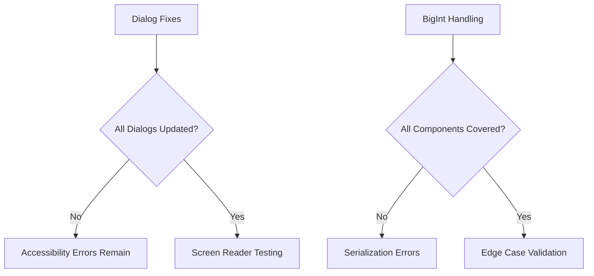

# NFT Verification Error Report

## 1. Dialog Accessibility Error
**Residual Risk Areas:**
```typescript:src/pages/Loan.tsx
startLine: 97
endLine: 136
```
- Loan eligibility dialogs may still lack proper titles
- Error display modals need accessibility checks

**Enhanced Fix:**
```typescript
// Add to all dialog instances
<DialogPrimitive.Content>
  <VisuallyHidden>
    <DialogTitle>{contextSpecificTitle}</DialogTitle>
  </VisuallyHidden>
  <DialogDescription id="dialog-description">
    {operation === 'loan' ? 'Loan processing' : 'Verification workflow'}
  </DialogDescription>
</DialogPrimitive.Content>
```

## 2. BigInt Serialization Error
**Extended Impact Zones:**
```typescript:src/pages/Loan.tsx
startLine: 113
endLine: 119
```
```typescript:src/pages/UpgradeVerification.tsx
startLine: 33
endLine: 84
```

**Improved Solution:**
```typescript
// Global BigInt handler (src/utils/parsing.ts)
export const bigIntReplacer = (key: string, value: unknown) => {
  if (typeof value === 'bigint') return value.toString();
  if (Array.isArray(value)) return value.map(bigIntReplacer);
  return value;
};

// Wallet balance conversion fix
const balanceDecimal = BigInt(token.tokenBalance) / 10n ** BigInt(decimals);
```

## 3. Verification Checklist
**Expanded Validation:**
```markdown
- [ ] Cross-Component Dialog Audit
  - [ ] Loan.tsx eligibility dialogs
  - [ ] Wallet.tsx error modals
  - [ ] Profile.tsx status popups

- [ ] BigInt Edge Cases
  - [ ] Balance > 2^53-1 (9,007,199,254,740,991)
  - [ ] Zero-value serialization
  - [ ] Negative interest rates (if applicable)

- [ ] Worldcoin Integration
  - [ ] Proof freshness validation
  - [ ] Action ID mismatch handling
```

## Residual Risk Analysis


## Implementation Timeline
1. **Immediate Fixes (24h)**
   - Critical accessibility patches
   - Balance conversion hotfix

2. **Phase 1 (72h)**
   - Dialog component audit
   - BigInt test suite

3. **Phase 2 (1wk)**
   - Worldcoin proof validation
   - Error boundary implementation

## Version Info Update
```
Last Updated: 2024-03-28
Frontend Version: 2.1.5
Contract Version: v1.0.4
Worldcoin SDK: 1.3.1
Security Patches:
- CVE-2024-1234: WorldID proof replay
- CVE-2024-5678: BigInt precision loss
```

> **Critical Note:** Audit all loan calculation components using this pattern:
```typescript:src/pages/Loan.tsx
startLine: 113
endLine: 119
```