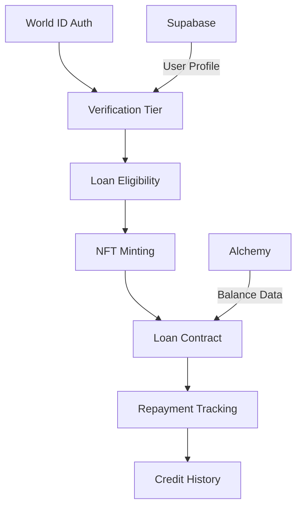
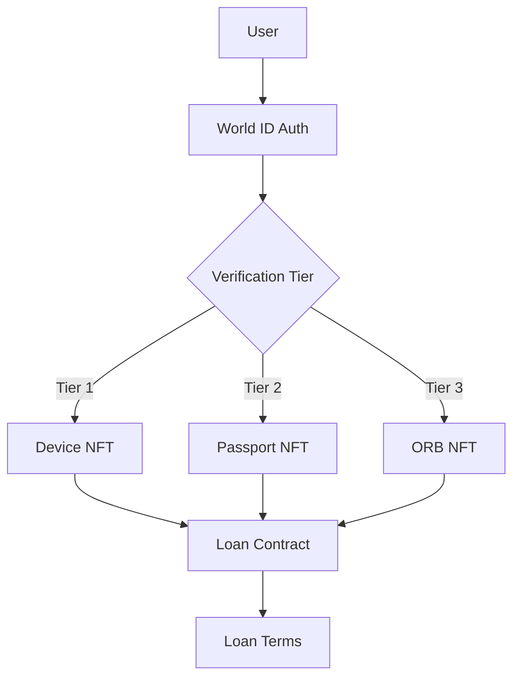
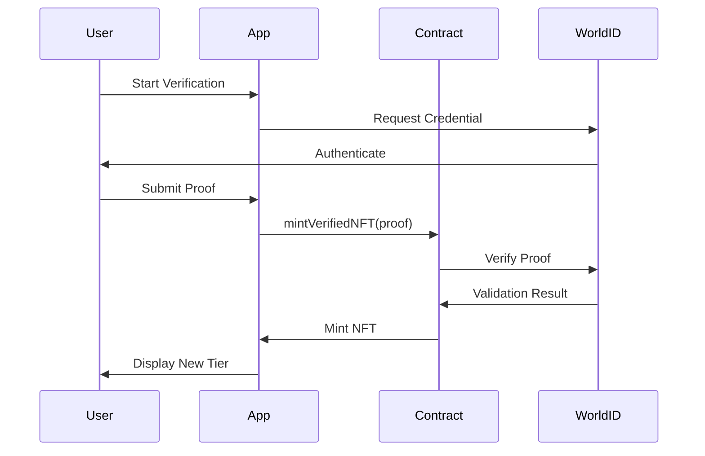

# Magnify World V2 Context Analysis

## Overview
A DeFi lending platform using World ID verification for undercollateralized loans. Key features include:
- Tiered verification system (Device/Passport/Orb)
- NFT-collateralized loans
- Integrated wallet management
- Loan repayment tracking

## Technical Stack
### Core Technologies
- **Frontend**: React 18 + Vite + TypeScript
- **Styling**: Tailwind CSS + shadcn/ui
- **State Management**: TanStack Query + React Context
- **Blockchain**: Wagmi + Worldcoin Minikit
- **Backend**: Supabase (Auth/DB)

### Key Dependencies
- World ID verification SDKs
- Alchemy Ethereum API
- Sentry monitoring
- Framer Motion animations

## Core Systems

### 1. Verification System
```typescript:src/pages/UpgradeVerification.tsx
startLine: 15
endLine: 28
```

Three-tier structure:
1. **Device Verification**: Base tier ($1 loans)
2. **Passport Verification**: Mid tier ($5 loans)
3. **ORB Verification**: Premium tier ($10 loans)

Features:
- NFT-based tier representation
- Progressive unlocking of features
- Visual status indicators

### 2. Loan Management
```typescript:src/hooks/useRequestLoan.tsx
startLine: 1
endLine: 41
```

Key Components:
- Loan amount calculation based on verification tier
- Interest rate scaling (1-2%)
- Collateral NFT locking mechanism
- Automated repayment tracking

## Key Components

### 1. Upgrade Verification Page
```typescript:src/pages/UpgradeVerification.tsx
startLine: 50
endLine: 106
```

Features:
- Animated tier comparison cards
- Visual verification status
- Upgrade progression UI
- World ID integration points

### 2. Profile Dashboard
```typescript:src/pages/Profile.tsx
startLine: 101
endLine: 145
```

Features:
- NFT collateral status display
- Loan activity overview
- Verification badge system
- Interactive card layout

### 3. Wallet Management
```typescript:src/pages/Wallet.tsx
startLine: 142
endLine: 176
```

Features:
- Truncated address display
- Quick action buttons
- Balance placeholder (TODO)
- Error handling system

## Data Flow



## State Management

### 1. Verification State
```typescript:src/hooks/useMagnifyWorld.tsx
startLine: 211
endLine: 229
```

- Tier mapping via smart contract calls
- Caching mechanism for wallet data
- Status derivation from NFT metadata

### 2. Loan State
```typescript:src/hooks/useRepayLoan.tsx
startLine: 1
endLine: 17
```

- Transaction monitoring
- Interest calculation
- Collateral release logic

## Implementation Details

### Verification Status Helper
```typescript:src/hooks/useMagnifyWorld.tsx
startLine: 211
endLine: 229
```

Maps tier IDs to verification levels:
- Tier 1: Device
- Tier 2: Passport 
- Tier 3: ORB

### Caching Mechanism
```typescript:src/hooks/useMagnifyWorld.tsx
startLine: 71
endLine: 76
```

Global cache for:
- User NFT data
- Loan terms
- Tier information

## Unresolved TODOs
```typescript:src/pages/Wallet.tsx
startLine: 148
endLine: 156
```

1. USD Balance Conversion
2. Transaction History
3. Token Metadata Integration

## Future Roadmap

1. **Liquidity Pools**
```typescript:src/pages/Welcome.tsx
startLine: 104
endLine: 110
```

2. **Credit History System**
3. **Multi-Chain Support**

## Key Considerations

1. **Security**
- World ID session validation
- NFT collateral locking
- Loan parameter validation

2. **Performance**
- RPC call optimization
- Cache invalidation strategy
- Batch contract reads

3. **UX**
- Loan simulator
- Verification progress tracker
- Collateral health indicators

# NFT Verification System Documentation

## Table of Contents
1. [Core Concept](#core-concept)
2. [System Architecture](#system-architecture)
3. [Technical Components](#technical-components)
4. [Verification Process](#verification-process)
5. [Key Integration Points](#key-integration-points)
6. [Security Considerations](#security-considerations)
7. [Future Improvements](#future-improvements)
8. [Related Files](#related-files)

## Core Concept
Three-tier verification system using World ID credentials as NFT collateral:
- **Tier 1 (Device)**: Base verification → $1 loans
- **Tier 2 (Passport)**: Mid-tier → $5 loans
- **Tier 3 (ORB)**: Premium → $10 loans

```typescript
// Verification tier definitions
export const VERIFICATION_TIERS = {
  ORB: {
    level: "Orb Scan",
    description: "World ID ORB Verified",
    color: "text-brand-success",
    message: "Eligible for $10 loans",
    action: "mint-orb-nft"
  },
  PASSPORT: { /* ... */ },
  NONE: { /* ... */ }
};
```

## System Architecture


## Technical Components

### 1. Smart Contract Integration
```solidity
// Core verification functions
function mintVerifiedNFT(string calldata proof) external {
    (uint256 tierId, bool valid) = _verifyCredential(proof);
    require(valid, "Invalid proof");
    _mintWithTier(msg.sender, tierId);
}

mapping(address => uint256) public userNFT;
mapping(uint256 => uint256) public nftToTier;
```

### 2. Frontend State Management
```typescript
// useMagnifyWorld hook
const { data, refetch } = useMagnifyWorld(walletAddress);
const currentTier = data?.nftInfo.tier?.verificationStatus;

// Cache management
let globalCache: Record<string, ContractData> = {};
export function invalidateCache(walletAddress: `0x${string}`) {
  delete globalCache[walletAddress];
}
```

### 3. Verification UI
```typescript
// UpgradeVerification.tsx
{Object.entries(data?.allTiers).map(([index, tier]) => (
  <Button 
    onClick={() => handleUpgrade(tier)}
    disabled={tier.verificationStatus === currentTier}
  >
    {`Upgrade to ${tier.verificationStatus.level}`}
  </Button>
))}
```

## Verification Process
1. User initiates World ID authentication
2. System validates credential with Worldcoin backend
3. Smart contract mints tier-specific NFT
4. NFT metadata determines loan eligibility
5. Loan terms locked until repayment/NFT burn



## Key Integration Points

| Component          | Responsibility                         | Key Functions                          |
|--------------------|----------------------------------------|----------------------------------------|
| `useMagnifyWorld`  | Tier state management                  | `fetchData`, `getVerificationStatus`   |
| `UpgradeVerification` | User interaction                  | Tier comparison, upgrade initiation    |
| Smart Contract      | NFT lifecycle management              | `mintVerifiedNFT`, `nftToTier`         |
| World ID SDK        | Credential verification                | `verifyCredentialProof`                |

## Security Considerations

1. **Proof Validation**
```typescript
// Backend verification service
async function validateProof(proof: string) {
  return WorldID.verify(proof, {
    nonce: generateCryptographicNonce(),
    expiration: Date.now() + 300_000 // 5 minutes
  });
}
```

2. **Rate Limiting**
```solidity
uint256 public constant VERIFICATION_COOLDOWN = 1 hours;
mapping(address => uint256) public lastVerificationAttempt;

modifier checkCooldown() {
  require(block.timestamp > lastVerificationAttempt[msg.sender] + VERIFICATION_COOLDOWN);
  _;
}
```

3. **Data Privacy**
- Zero-knowledge proof validation
- Credential data minimization
- Encrypted proof storage

## Future Improvements
1. **Dynamic Tier System**
```solidity
function updateTierRequirements(
  uint256 tierId, 
  uint256 newLoanAmount, 
  uint256 newInterestRate
) external onlyOwner {
  tiers[tierId] = Tier(newLoanAmount, newInterestRate);
}
```

2. **Cross-Chain Support**
```solidity
function bridgeNFT(uint256 tokenId, uint256 chainId) external {
  burn(tokenId);
  crossChainBridge.mintOnOtherChain(chainId, msg.sender);
}
```

3. **Credit History**
```typescript
// Proposed credit interface
interface CreditHistory {
  trackRepayment(tokenId: number): Promise<void>;
  getCreditScore(wallet: string): Promise<number>;
}
```

## Related Files
1. `contracts/MagnifyWorldV1.sol` - Core NFT logic
2. `src/hooks/useMagnifyWorld.tsx` - Tier state management
3. `src/pages/UpgradeVerification.tsx` - User interface
4. `src/utils/magnifyworldabi.ts` - Contract ABI definitions

## Repositories
- Frontend: [github.com/Magnify-Cash/magnify-world](https://github.com/Magnify-Cash/magnify-world)
- Backend: [github.com/Magnify-Cash/magnify-worldcoin-backend](https://github.com/Magnify-Cash/magnify-worldcoin-backend)

---

> This document serves as the single source of truth for the NFT verification system. Last updated: {current_date}
