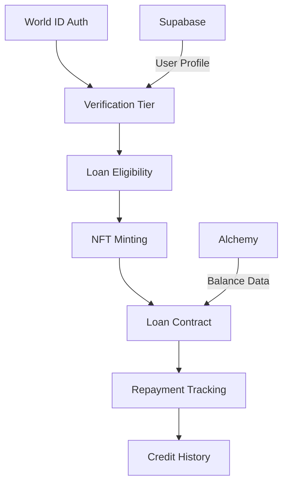

# Magnify World V2 Context Analysis

## Overview
A DeFi lending platform using World ID verification for undercollateralized loans. Key features include:
- Tiered verification system (Device/Passport/Orb)
- NFT-collateralized loans
- Integrated wallet management
- Loan repayment tracking

## Technical Stack
### Core Technologies
- **Frontend**: React 18 + Vite + TypeScript
- **Styling**: Tailwind CSS + shadcn/ui
- **State Management**: TanStack Query + React Context
- **Blockchain**: Wagmi + Worldcoin Minikit
- **Backend**: Supabase (Auth/DB)

### Key Dependencies
- World ID verification SDKs
- Alchemy Ethereum API
- Sentry monitoring
- Framer Motion animations

## Core Systems

### 1. Verification System
```typescript:src/pages/UpgradeVerification.tsx
startLine: 15
endLine: 28
```

Three-tier structure:
1. **Device Verification**: Base tier ($1 loans)
2. **Passport Verification**: Mid tier ($5 loans)
3. **ORB Verification**: Premium tier ($10 loans)

Features:
- NFT-based tier representation
- Progressive unlocking of features
- Visual status indicators

### 2. Loan Management
```typescript:src/hooks/useRequestLoan.tsx
startLine: 1
endLine: 41
```

Key Components:
- Loan amount calculation based on verification tier
- Interest rate scaling (1-2%)
- Collateral NFT locking mechanism
- Automated repayment tracking

## Key Components

### 1. Upgrade Verification Page
```typescript:src/pages/UpgradeVerification.tsx
startLine: 50
endLine: 106
```

Features:
- Animated tier comparison cards
- Visual verification status
- Upgrade progression UI
- World ID integration points

### 2. Profile Dashboard
```typescript:src/pages/Profile.tsx
startLine: 101
endLine: 145
```

Features:
- NFT collateral status display
- Loan activity overview
- Verification badge system
- Interactive card layout

### 3. Wallet Management
```typescript:src/pages/Wallet.tsx
startLine: 142
endLine: 176
```

Features:
- Truncated address display
- Quick action buttons
- Balance placeholder (TODO)
- Error handling system

## Data Flow



## State Management

### 1. Verification State
```typescript:src/hooks/useMagnifyWorld.tsx
startLine: 211
endLine: 229
```

- Tier mapping via smart contract calls
- Caching mechanism for wallet data
- Status derivation from NFT metadata

### 2. Loan State
```typescript:src/hooks/useRepayLoan.tsx
startLine: 1
endLine: 17
```

- Transaction monitoring
- Interest calculation
- Collateral release logic

## Implementation Details

### Verification Status Helper
```typescript:src/hooks/useMagnifyWorld.tsx
startLine: 211
endLine: 229
```

Maps tier IDs to verification levels:
- Tier 1: Device
- Tier 2: Passport 
- Tier 3: ORB

### Caching Mechanism
```typescript:src/hooks/useMagnifyWorld.tsx
startLine: 71
endLine: 76
```

Global cache for:
- User NFT data
- Loan terms
- Tier information

## Unresolved TODOs
```typescript:src/pages/Wallet.tsx
startLine: 148
endLine: 156
```

1. USD Balance Conversion
2. Transaction History
3. Token Metadata Integration

## Future Roadmap

1. **Liquidity Pools**
```typescript:src/pages/Welcome.tsx
startLine: 104
endLine: 110
```

2. **Credit History System**
3. **Multi-Chain Support**

## Key Considerations

1. **Security**
- World ID session validation
- NFT collateral locking
- Loan parameter validation

2. **Performance**
- RPC call optimization
- Cache invalidation strategy
- Batch contract reads

3. **UX**
- Loan simulator
- Verification progress tracker
- Collateral health indicators
