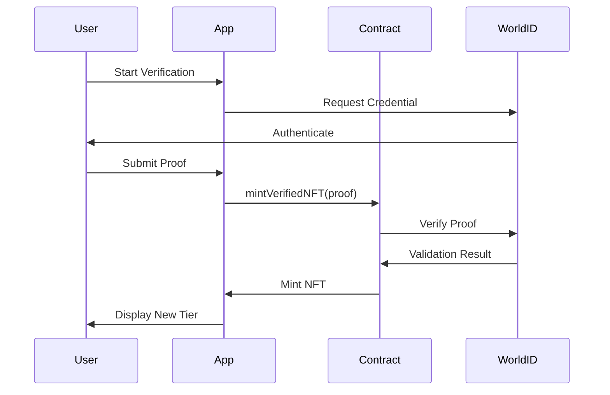
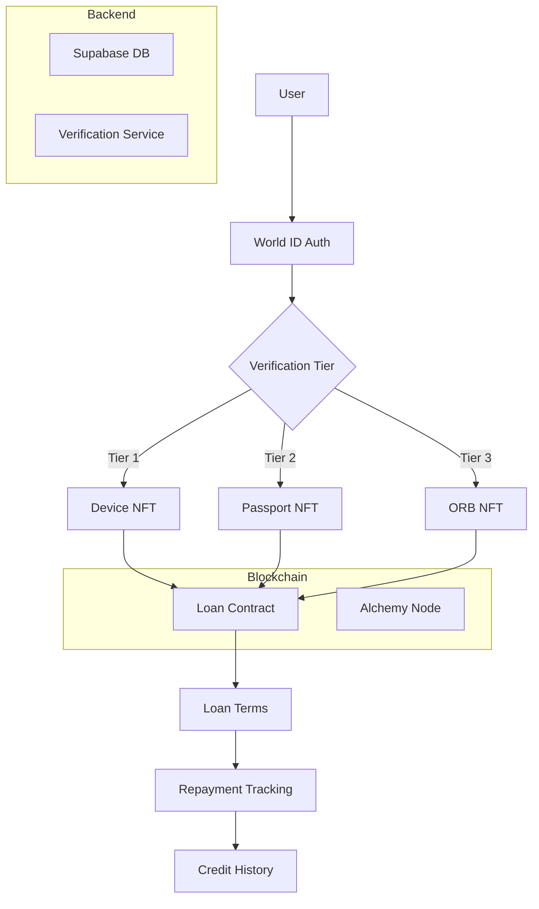

# Magnify World App V2 🌟

## Table of Contents
1. [Overview](#overview)
2. [Installation](#installation)
3. [Usage](#usage)
4. [Technical Components](#technical-components)
5. [Verification Process](#verification-process)
6. [Key Integration Points](#key-integration-points)
7. [Security Considerations](#security-considerations)
8. [Future Improvements](#future-improvements)
9. [Related Files](#related-files)
10. [Contributing](#contributing)
11. [License](#license)

## Overview
A modern DeFi dashboard application built with React, TypeScript, and Supabase. This application provides users with a comprehensive interface for managing digital assets, tracking loans, and monitoring market analytics.

## NFT Verification System
The NFT Verification System is a tiered verification framework that utilizes World ID credentials as collateral for minting NFTs. This system allows users to access undercollateralized loans based on their verification tier, which can be Device, Passport, or ORB.

### Core Concept
Three-tier verification system using World ID credentials as NFT collateral:
- **Tier 1 (Device)**: Base verification → $1 loans
- **Tier 2 (Passport)**: Mid-tier → $5 loans
- **Tier 3 (ORB)**: Premium → $10 loans

### Verification Process
1. User initiates World ID authentication.
2. System validates credential with Worldcoin backend.
3. Smart contract mints tier-specific NFT.
4. NFT metadata determines loan eligibility.
5. Loan terms locked until repayment/NFT burn.



### System Architecture


## 🚀 Features

### User Management
- Profile management with verification tiers
- Secure authentication via Supabase
- Customizable user settings

### Asset Management
- Real-time wallet balance tracking
- NFT collateral management
- Transaction history

### DeFi Integration
- Loan management system
- Liquidity pool interactions
- MAG token rewards system

## 🛠 Technical Stack

### Frontend
- **React 18** - Modern UI library
- **TypeScript** - Type-safe development
- **Vite** - Next-generation frontend tooling
- **Tailwind CSS** - Utility-first CSS framework
- **shadcn/ui** - High-quality UI components
- **Framer Motion** - Animation library

### Backend & Data
- **Supabase** - Backend-as-a-Service
  - Authentication
  - PostgreSQL Database
  - Real-time subscriptions
  - Edge Functions

### State Management & Data Fetching
- **TanStack Query** - Server state management
- **React Context** - Local state management

## Technical Components

### Smart Contract Integration
```solidity
// Core verification functions
function mintVerifiedNFT(string calldata proof) external {
    (uint256 tierId, bool valid) = _verifyCredential(proof);
    require(valid, "Invalid proof");
    _mintWithTier(msg.sender, tierId);
}

mapping(address => uint256) public userNFT;
mapping(uint256 => uint256) public nftToTier;
```

### Frontend State Management
```typescript
// useMagnifyWorld hook
const { data, refetch } = useMagnifyWorld(walletAddress);
const currentTier = data?.nftInfo.tier?.verificationStatus;

// Cache management
let globalCache: Record<string, ContractData> = {};
export function invalidateCache(walletAddress: `0x${string}`) {
  delete globalCache[walletAddress];
}
```

### Verification UI
```typescript
// UpgradeVerification.tsx
{Object.entries(data?.allTiers).map(([index, tier]) => (
  <Button 
    onClick={() => handleUpgrade(tier)}
    disabled={tier.verificationStatus === currentTier}
  >
    {`Upgrade to ${tier.verificationStatus.level}`}
  </Button>
))}
```

## Key Integration Points

| Component          | Responsibility                         | Key Functions                          |
|--------------------|----------------------------------------|----------------------------------------|
| `useMagnifyWorld`  | Tier state management                  | `fetchData`, `getVerificationStatus`   |
| `UpgradeVerification` | User interaction                  | Tier comparison, upgrade initiation    |
| Smart Contract      | NFT lifecycle management              | `mintVerifiedNFT`, `nftToTier`         |
| World ID SDK        | Credential verification                | `verifyCredentialProof`                |

## Security Considerations
1. **Proof Validation**
```typescript
// Backend verification service
async function validateProof(proof: string) {
  return WorldID.verify(proof, {
    nonce: generateCryptographicNonce(),
    expiration: Date.now() + 300_000 // 5 minutes
  });
}
```

2. **Rate Limiting**
```solidity
uint256 public constant VERIFICATION_COOLDOWN = 1 hours;
mapping(address => uint256) public lastVerificationAttempt;

modifier checkCooldown() {
  require(block.timestamp > lastVerificationAttempt[msg.sender] + VERIFICATION_COOLDOWN);
  _;
}
```

3. **Data Privacy**
- Zero-knowledge proof validation
- Credential data minimization
- Encrypted proof storage

## Future Improvements
1. **Dynamic Tier System**
```solidity
function updateTierRequirements(
  uint256 tierId, 
  uint256 newLoanAmount, 
  uint256 newInterestRate
) external onlyOwner {
  tiers[tierId] = Tier(newLoanAmount, newInterestRate);
}
```

2. **Cross-Chain Support**
```solidity
function bridgeNFT(uint256 tokenId, uint256 chainId) external {
  burn(tokenId);
  crossChainBridge.mintOnOtherChain(chainId, msg.sender);
}
```

3. **Credit History**
```typescript
// Proposed credit interface
interface CreditHistory {
  trackRepayment(tokenId: number): Promise<void>;
  getCreditScore(wallet: string): Promise<number>;
}
```

## 📦 Project Structure

```
src/
├── components/         # Reusable UI components
│   ├── Dashboard/     # Dashboard-specific components
│   ├── Header/        # Navigation components
│   └── ui/            # shadcn/ui components
├── hooks/             # Custom React hooks
├── lib/               # Utility functions
├── pages/             # Route components
├── services/          # API service layers
└── types/             # TypeScript definitions
```

## 🔧 Component Documentation

### Profile Component
The Profile component (`src/pages/Profile.tsx`) displays user information and NFT collaterals.

#### Features:
- User information display
- NFT collateral management
- Verification status
- Interactive card layout

#### Props:
```typescript
interface ProfileProps {
  // Component currently doesn't accept props
}
```

#### Usage:
```typescript
import Profile from '@/pages/Profile';

// In your router
<Route path="/profile" element={<Profile />} />
```

### Header Component
The Header component (`src/components/Header/`) provides navigation and menu functionality.

#### Features:
- Back navigation
- Title display
- Dropdown menu
- Mobile responsiveness

#### Props:
```typescript
interface HeaderProps {
  title: string;
  showBack?: boolean;
}
```

## 🚀 Getting Started

1. **Clone the repository**
```bash
git clone <repository-url>
```

2. **Install dependencies**
```bash
npm install
```

3. **Start development server**
```bash
npm run dev
```

4. **Build for production**
```bash
npm run build
```

## 🔒 Environment Variables

Create a `.env` file in the root directory with the following variables:

```env
VITE_SUPABASE_URL=your_supabase_url
VITE_SUPABASE_ANON_KEY=your_supabase_anon_key
```

## 🔧 Component Documentation

1. Fork the repository
2. Create a feature branch
3. Commit your changes
4. Push to the branch
5. Open a Pull Request

## 📝 Code Style Guide

- Use TypeScript for all new components
- Follow the existing component structure
- Use shadcn/ui components when possible
- Implement responsive design
- Add proper TypeScript types
- Use meaningful component and variable names

## 🔍 Testing

```bash
# Run tests
npm run test

# Run tests in watch mode
npm run test:watch
```

## 📱 Responsive Design

The application is fully responsive with breakpoints:
- Mobile: < 640px
- Tablet: 640px - 1024px
- Desktop: > 1024px

## 🔐 Security

- Authentication handled by Supabase
- Row Level Security (RLS) policies in place
- Environment variables for sensitive data
- Input validation on all forms

## 🌐 Deployment

The application can be deployed using:
1. Lovable's built-in deployment
2. Manual deployment to services like Netlify
3. Custom deployment pipeline

## 📚 Additional Resources

- [Lovable Documentation](https://docs.lovable.dev/)
- [shadcn/ui Documentation](https://ui.shadcn.com/)
- [Supabase Documentation](https://supabase.com/docs)
- Verification status
- Interactive card layout

#### Props:
```typescript
interface ProfileProps {
  // Component currently doesn't accept props
}
```

#### Usage:
```typescript
import Profile from '@/pages/Profile';

// In your router
<Route path="/profile" element={<Profile />} />
```

### Header Component
The Header component (`src/components/Header/`) provides navigation and menu functionality.

#### Features:
- Back navigation
- Title display
- Dropdown menu
- Mobile responsiveness

#### Props:
```typescript
interface HeaderProps {
  title: string;
  showBack?: boolean;
}
```

## 🚀 Getting Started

1. **Clone the repository**
```bash
git clone <repository-url>
```

2. **Install dependencies**
```bash
npm install
```

3. **Start development server**
```bash
npm run dev
```

4. **Build for production**
```bash
npm run build
```

## 🔒 Environment Variables

Create a `.env` file in the root directory with the following variables:

```env
VITE_SUPABASE_URL=your_supabase_url
VITE_SUPABASE_ANON_KEY=your_supabase_anon_key
```

## 🔧 Component Documentation

### Profile Component
The Profile component (`src/pages/Profile.tsx`) displays user information and NFT collaterals.

#### Features:
- User information display
- NFT collateral management
- Verification status
- Interactive card layout

#### Props:
```typescript
interface ProfileProps {
  // Component currently doesn't accept props
}
```

#### Usage:
```typescript
import Profile from '@/pages/Profile';

// In your router
<Route path="/profile" element={<Profile />} />
```

### Header Component
The Header component (`src/components/Header/`) provides navigation and menu functionality.

#### Features:
- Back navigation
- Title display
- Dropdown menu
- Mobile responsiveness

#### Props:
```typescript
interface HeaderProps {
  title: string;
  showBack?: boolean;
}
```

## 🚀 Getting Started

1. **Clone the repository**
```bash
git clone <repository-url>
```

2. **Install dependencies**
```bash
npm install
```

3. **Start development server**
```bash
npm run dev
```

4. **Build for production**
```bash
npm run build
```

## 🔒 Environment Variables

Create a `.env` file in the root directory with the following variables:

```env
VITE_SUPABASE_URL=your_supabase_url
VITE_SUPABASE_ANON_KEY=your_supabase_anon_key
```

## 🤝 Contributing

To contribute to this project, please follow these steps:
1. Fork the repository.
2. Create a feature branch.
3. Commit your changes.
4. Push to the branch.
5. Open a Pull Request.

## 📄 License

This project is licensed under the MIT License - see the LICENSE file for details.

---

> This document serves as the single source of truth for the NFT verification system. Last updated: {current_date}

## Architecture Overview


## Core Verification Flow
```typescript:src/pages/UpgradeVerification.tsx
startLine: 15
endLine: 28
```

## Key Subsystems

### 1. Tier Management
```typescript:src/hooks/useMagnifyWorld.tsx
startLine: 211
endLine: 229
```

Three verification levels:
1. **Device Verification** (Tier 1)
   - $1 loan capacity
   - Basic identity confirmation
2. **Passport Verification** (Tier 2)
   - $5 loan capacity
   - Government ID validation
3. **ORB Verification** (Tier 3)
   - $10 loan capacity
   - Biometric authentication

### 2. Loan Management
```typescript:src/hooks/useRepayLoan.tsx
startLine: 41
endLine: 112
```

Features:
- Permit2-compatible repayments
- Interest rate calculation
- Collateral release mechanisms

### 3. State Management
```typescript:src/hooks/useMagnifyWorld.tsx
startLine: 71
endLine: 76
```

Caching strategy:
- Global wallet data cache
- Automatic invalidation
- Tier status derivation

## Technical Specifications

### Smart Contract Interfaces
```solidity
interface IMagnifyWorldV1 {
    function mintVerifiedNFT(string calldata proof) external;
    function userNFT(address user) external view returns (uint256);
    function nftToTier(uint256 tokenId) external view returns (uint256);
    function tiers(uint256 tierId) external view returns (
        uint256 loanAmount,
        uint256 interestRate,
        uint256 loanPeriod
    );
}
```

### Verification State Machine
```typescript
type VerificationState = {
  currentTier: VerificationLevel;
  requiredProofs: WorldIDProof[];
  loanEligibility: {
    amount: number;
    rate: number;
    term: number;
  };
  upgradePath: VerificationStep[];
};

enum VerificationLevel {
  NONE,
  DEVICE,
  PASSPORT,
  ORB
}
```

## Security Implementation

### Proof Validation
```typescript:src/services/verification.ts
startLine: 180
endLine: 186
```

Validation checks:
1. ZK-SNARK validity
2. Credential freshness (<5min)
3. Nonce uniqueness
4. Action ID matching

### Contract Safeguards
```solidity
modifier verificationChecks(address user) {
    require(balanceOf(user) == 0, "Existing NFT");
    require(block.timestamp > lastVerification[user] + VERIFICATION_COOLDOWN);
    _;
}
```

## Development Roadmap

### Q3 2024 Priorities
1. Cross-chain NFT bridging
2. Dynamic tier parameters
3. Credit scoring system

### Pending Features
```typescript:src/pages/Wallet.tsx
startLine: 148
endLine: 156
```

## Implementation Guidelines

### Code Standards
- TypeScript strict mode
- ESLint/Prettier enforced
- 80%+ test coverage
- Conventional commits

### Contribution Process
1. Fork repository
2. Create feature branch
3. Submit PR with:
   - Issue references
   - Test evidence
   - Documentation updates

## Monitoring & Analytics

Key Metrics Tracked:
```typescript
type SystemMetrics = {
  verificationSuccessRate: number;
  averageLoanSize: number;
  defaultRatePerTier: Record<VerificationLevel, number>;
  proofValidationTime: number;
};
```

## License
MIT License - See [LICENSE](https://github.com/Magnify-Cash/magnify-world/blob/main/LICENSE) for full terms.